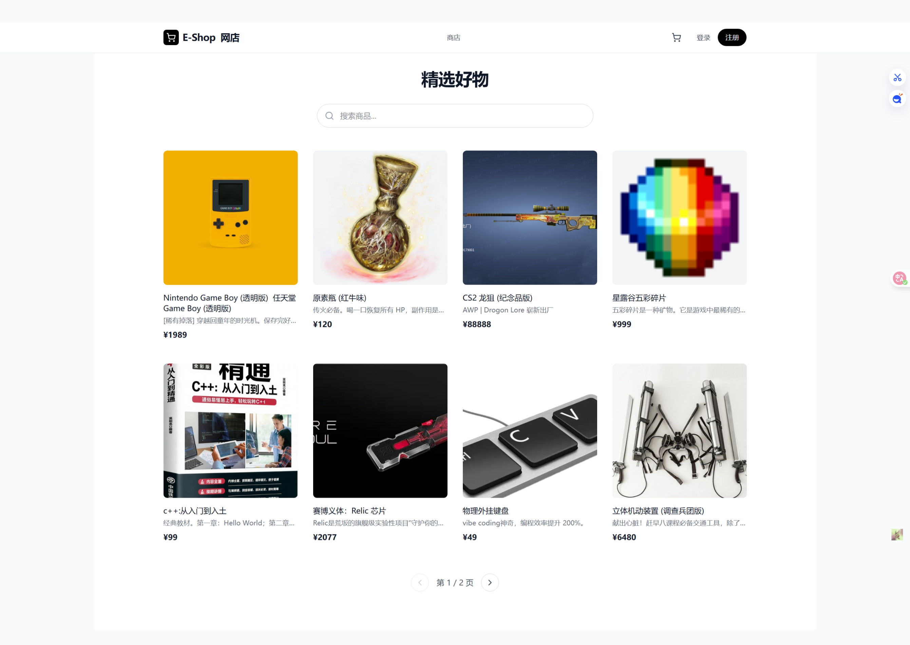
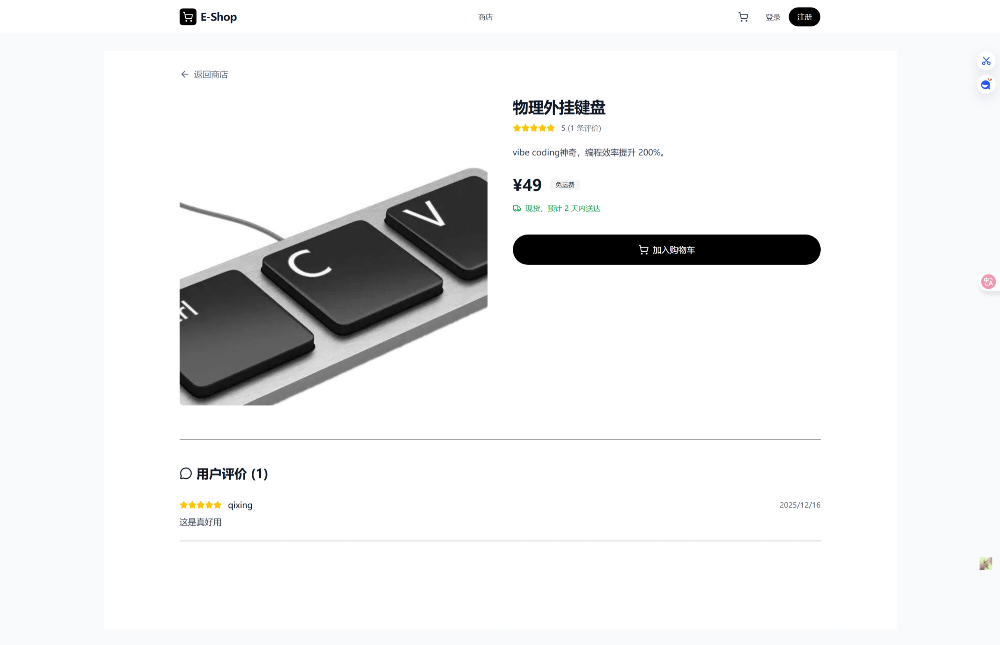
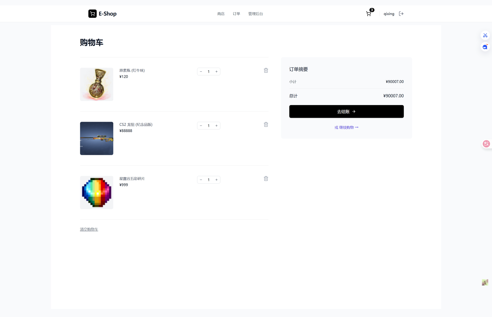

# Purchasing Web (在线采购商城系统)

这是一个基于 MERN 栈 (MongoDB, Express, React, Node.js) 构建的全功能在线采购商城系统。该项目旨在提供一个完整的电子商务解决方案，涵盖了从用户浏览商品、下单支付到管理员后台管理的全流程。

## 📚 目录

- [项目简介](#项目简介)
- [功能特性](#功能特性)
- [技术栈](#技术栈)
- [项目结构](#项目结构)
- [快速开始](#快速开始)
  - [环境要求](#环境要求)
  - [安装与运行](#安装与运行)
  - [环境变量配置](#环境变量配置)
- [API 文档](#api-文档)
- [系统截图](#系统截图)

## 📖 项目简介

Purchasing Web 是一个现代化的 B2C/B2B 采购平台。它不仅为普通用户提供了流畅的购物体验，还为管理员提供了强大的后台管理系统，用于监控销售数据、管理商品库存以及追踪系统操作日志。

## ✨ 功能特性

### 👤 用户端 (Client)
- **用户认证**：支持邮箱注册（含验证码验证）、登录及 JWT 自动登录。
- **商品浏览**：首页展示热销商品，支持查看商品详情。
- **购物车**：添加商品到购物车，实时计算总价。
- **订单管理**：
  - 下单流程（填写地址、确认订单）。
  - 模拟支付功能。
  - 查看历史订单状态。
- **个人中心**：查看和修改个人信息（昵称、地址管理）。
- **商品评价**：购买后可对商品进行评分和评论。

### 🛡️ 管理员后台 (Admin Dashboard)
- **数据仪表盘**：可视化展示关键业务指标（订单总数、总销售额、已支付订单、平均客单价）。
- **商品管理**：
  - 查看所有商品列表。
  - **添加新商品**：支持上传图片链接、设置库存、价格等。
  - **编辑商品**：修改现有商品信息。
  - **删除商品**：下架不再销售的商品。
- **系统日志**：
  - 全面的操作审计日志，记录用户登录、注册、浏览商品、下单、评论等关键行为。
  - 显示操作时间、用户身份（姓名及邮箱）、操作类型及详细信息。

## 🛠️ 技术栈

### 前端 (Client)
- **框架**: [React](https://react.dev/) (v19)
- **构建工具**: [Vite](https://vitejs.dev/)
- **路由**: [React Router v7](https://reactrouter.com/)
- **样式**: [Tailwind CSS](https://tailwindcss.com/) (v4)
- **HTTP 请求**: [Axios](https://axios-http.com/)
- **图标库**: [Lucide React](https://lucide.dev/)
- **通知提示**: [React Hot Toast](https://react-hot-toast.com/)

### 后端 (Server)
- **运行环境**: [Node.js](https://nodejs.org/)
- **Web 框架**: [Express](https://expressjs.com/)
- **数据库**: [MongoDB](https://www.mongodb.com/) (配合 [Mongoose](https://mongoosejs.com/) ODM)
- **认证**: [JSON Web Token (JWT)](https://jwt.io/)
- **加密**: [Bcryptjs](https://www.npmjs.com/package/bcryptjs)
- **邮件服务**: [Nodemailer](https://nodemailer.com/) (用于发送验证码)
- **验证**: [Zod](https://zod.dev/) (数据校验)

## 📂 项目结构

```
purchasing_web/
├── client/                 # 前端 React 项目
│   ├── src/
│   │   ├── api/           # Axios 配置
│   │   ├── components/    # 公共组件 (Navbar, ErrorBoundary等)
│   │   ├── context/       # React Context (Auth, Cart)
│   │   ├── pages/         # 页面组件 (Home, Admin, Cart等)
│   │   └── ...
│   └── ...
├── server/                 # 后端 Express 项目
│   ├── config/            # 数据库配置
│   ├── controllers/       # 业务逻辑控制器
│   ├── middleware/        # 中间件 (Auth等)
│   ├── models/            # Mongoose 数据模型 (User, Product, Order, Log等)
│   ├── routes/            # API 路由定义
│   ├── utils/             # 工具函数 (Logger, SendEmail)
│   └── index.js           # 入口文件
└── README.md              # 项目说明文档
```

## 🚀 快速开始

### 环境要求
- [Node.js](https://nodejs.org/) (v16 或更高版本)
- [MongoDB](https://www.mongodb.com/) (本地安装或使用 MongoDB Atlas 云服务)
- [Git](https://git-scm.com/)

### 安装与运行

1.  **克隆项目**
    ```bash
    git clone https://github.com/qixing1227/purchasing-web.git
    cd purchasing_web
    ```

2.  **后端设置**
    ```bash
    cd server
    npm install
    # 配置环境变量 (见下文)
    npm start
    # 或者使用 nodemon 开发模式
    # npm run dev (如果配置了)
    ```
    后端默认运行在 `http://localhost:5000`。

3.  **前端设置**
    打开一个新的终端窗口：
    ```bash
    cd client
    npm install
    npm run dev
    ```
    前端默认运行在 `http://localhost:5173`。

### 环境变量配置

在 `server` 目录下创建一个 `.env` 文件，并填入以下配置：

```env
PORT=5000
MONGO_URI=mongodb://localhost:27017/purchasing_web  # 或你的 MongoDB Atlas 连接串
JWT_SECRET=your_super_secret_jwt_key              # 用于生成 Token 的密钥
EMAIL_SERVICE=qq                                  # 邮件服务商 (如 qq, gmail)
EMAIL_USER=your_email@qq.com                      # 发送验证码的邮箱
EMAIL_PASS=your_email_password_or_app_token       # 邮箱密码或应用授权码
```

> **注意**: 邮件服务配置用于注册时的验证码发送功能。如果不需要此功能，可能需要修改相关代码或提供模拟数据。

## 📡 API 文档

后端 API 基础路径为 `/api`。

| 模块 | 方法 | 路径 | 描述 |
| :--- | :--- | :--- | :--- |
| **Auth** | POST | `/auth/register` | 用户注册 (发送验证码) |
| | POST | `/auth/verify-email` | 验证邮箱并完成注册 |
| | POST | `/auth/login` | 用户登录 |
| **Products** | GET | `/products` | 获取商品列表 |
| | GET | `/products/:id` | 获取商品详情 |
| | POST | `/products` | 创建商品 (Admin) |
| | PUT | `/products/:id` | 更新商品 (Admin) |
| | DELETE | `/products/:id` | 删除商品 (Admin) |
| **Orders** | POST | `/orders` | 创建订单 |
| | GET | `/orders/myorders` | 获取当前用户的订单 |
| | GET | `/orders/admin/stats` | 获取后台统计数据 (Admin) |
| **Logs** | GET | `/logs` | 获取系统操作日志 (Admin) |

## 🖼️ 系统截图

### 首页
**

### 商品详情页
**

### 购物车与下单
**

### 管理员后台 - 仪表盘
**

### 管理员后台 - 商品管理
**

### 管理员后台 - 系统日志
**

---

**License**
ISC
